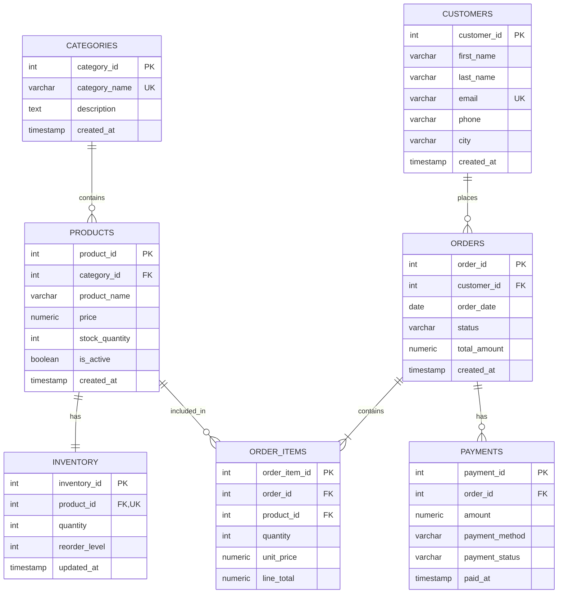

# E-Commerce Database ER Diagram

```mermaid
erDiagram
    CATEGORIES ||--o{ PRODUCTS : contains
    PRODUCTS ||--|| INVENTORY : has
    CUSTOMERS ||--o{ ORDERS : places
    ORDERS ||--|{ ORDER_ITEMS : contains
    PRODUCTS ||--o{ ORDER_ITEMS : included_in
    ORDERS ||--o{ PAYMENTS : has

    CATEGORIES {
        int category_id PK
        varchar category_name UK
        text description
        timestamp created_at
    }

    PRODUCTS {
        int product_id PK
        int category_id FK
        varchar product_name
        numeric price
        int stock_quantity
        boolean is_active
        timestamp created_at
    }

    INVENTORY {
        int inventory_id PK
        int product_id FK,UK
        int quantity
        int reorder_level
        timestamp updated_at
    }

    CUSTOMERS {
        int customer_id PK
        varchar first_name
        varchar last_name
        varchar email UK
        varchar phone
        varchar city
        timestamp created_at
    }

    ORDERS {
        int order_id PK
        int customer_id FK
        date order_date
        varchar status
        numeric total_amount
        timestamp created_at
    }

    ORDER_ITEMS {
        int order_item_id PK
        int order_id FK
        int product_id FK
        int quantity
        numeric unit_price
        numeric line_total
    }

    PAYMENTS {
        int payment_id PK
        int order_id FK
        numeric amount
        varchar payment_method
        varchar payment_status
        timestamp paid_at
    }
```
